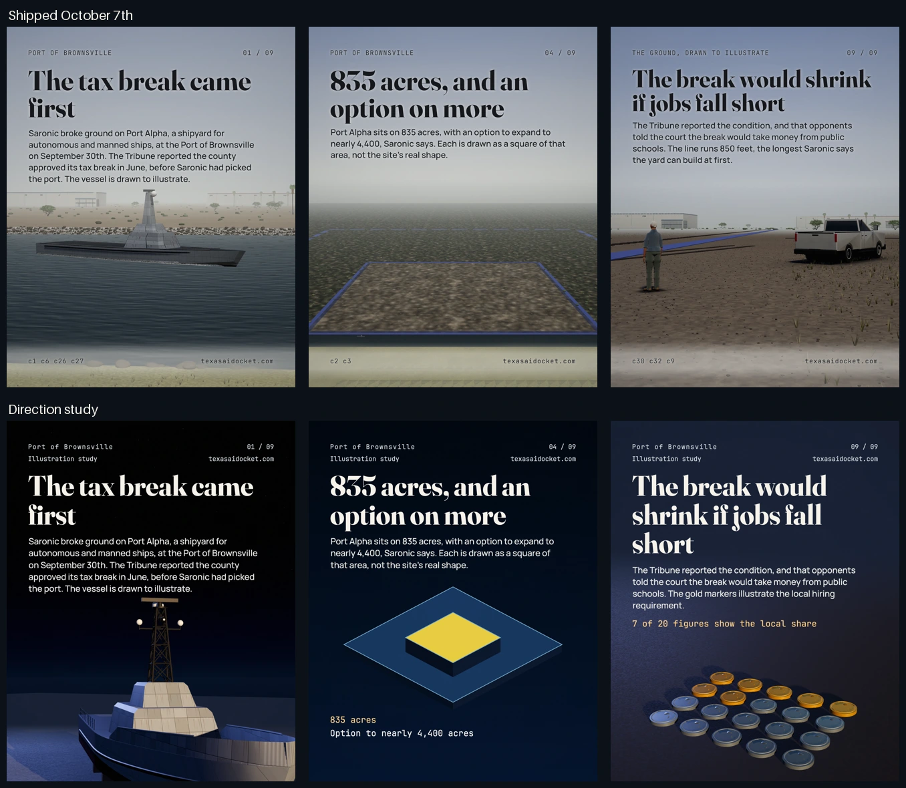

# Three compositions before nine

The daily routine kept reading main while the staged-world upgrade remained on an unmerged
branch. Its October 7th deck then repeated wide views of small models in a pale scene. The
GitHub source pins, trigger comparison and measured corpus are recorded in
[the illustration system](../../knowledge/carousel/ILLUSTRATION_SYSTEM.md#three-compositions-before-nine)
and [audit.json](audit.json).

This study takes the October 7th Port of Brownsville story through three different compositions:
a close vessel view, a measured area comparison and twenty physical hiring markers. The existing
headlines remain exact. The close's body now describes its markers rather than a line drawn in
the original wide view. The figure inputs are the original Texas run's `figures.json`.



The cover uses the existing vessel model with a lower camera, a close crop and warm side light
against a cool field. The evidence frame compares squares of 835 acres and nearly 4,400 acres;
their side lengths come from the committed calculations. The close renders seven gold markers
among twenty, the same illustrative 35 percent local share the original run computed. These are
drawings, with the disclosures on the frames. They establish a direction for future production;
the historical carousel remains as shipped.

The vessel is still stylized, the area frame deliberately leaves breathing room and the markers
are a schematic. No new scoring panel has graded this study. A luminance check establishes the
tonal change; it does not establish an artwork score.

## The review that stays with the images

`art_preflight.json` holds the accepted review of all three rendered images, with their source,
chassis and image SHA-256 digests. A replaced image, changed source or changed chassis invalidates
the live review. `panel_ready.py` checks it before scoring, and `shipped_check.py` checks it in the
archive. The first newly governed daily run is October 8th.

The shipping export compares compressed images to reviewed PNGs against `ship_images.py`'s
existing quality floor, preserves the original review and records the delivered hashes. That
allows the proof to survive compression without committing duplicate lossless PNGs. The working
images and machine QA are inspected before export. This study had zero machine QA failures;
the area frame's low lower-third density remains an advisory the reviewer considered.

The routine, treatment director, flow critic, pixel critic, rubric, engine, gates, workflow and
generated arsenal carry the same direction. The existing scoring bar, three panel rounds, six
rendered views and five exterior views remain in force. Companion frames carry maps, cutaways
and evidence graphics, while physical views vary camera distance and subject state.

Verify the committed proof with:

```bash
python3 scripts/carousel/art_preflight.py --self-test
python3 scripts/carousel/art_preflight.py --run examples/art-direction-proof
```

Re-render the three source files into a working `render/` directory, run machine QA and build a
fresh review when changing this study. Do not copy its scenes into a future story. Its shared
chassis carries light and type; each HTML file composes its own evidence.
