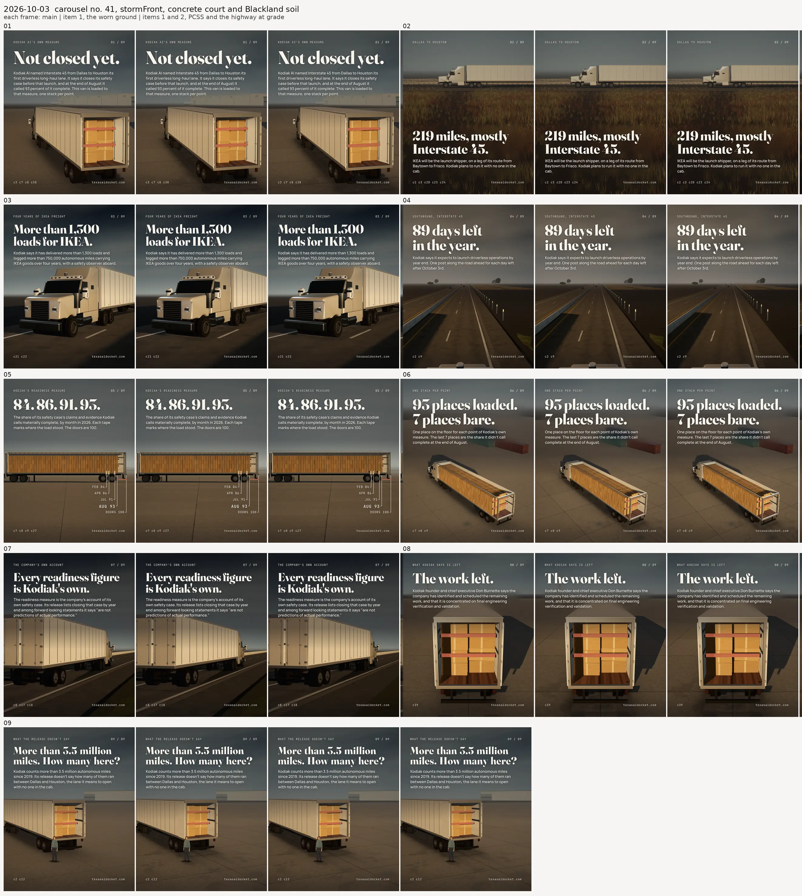
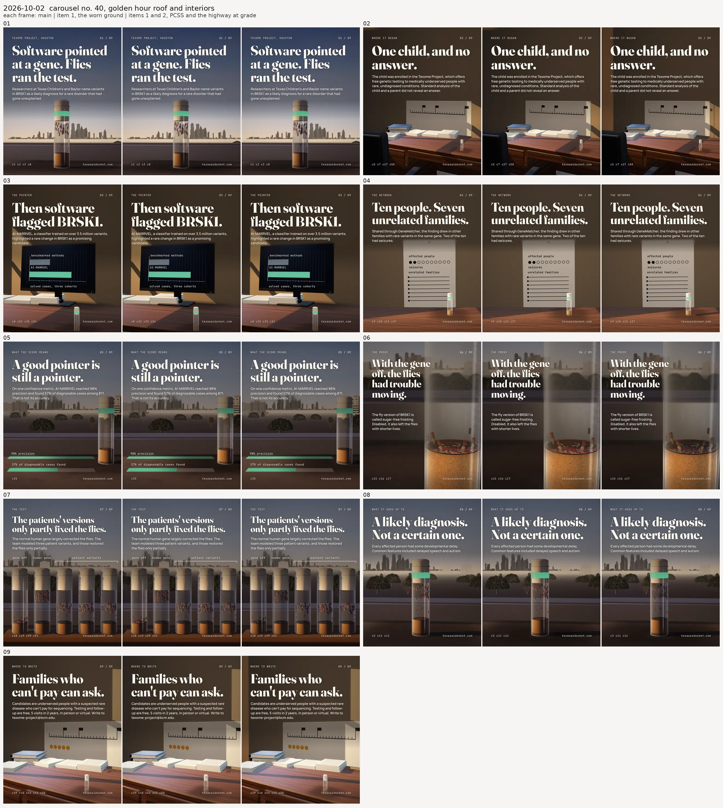
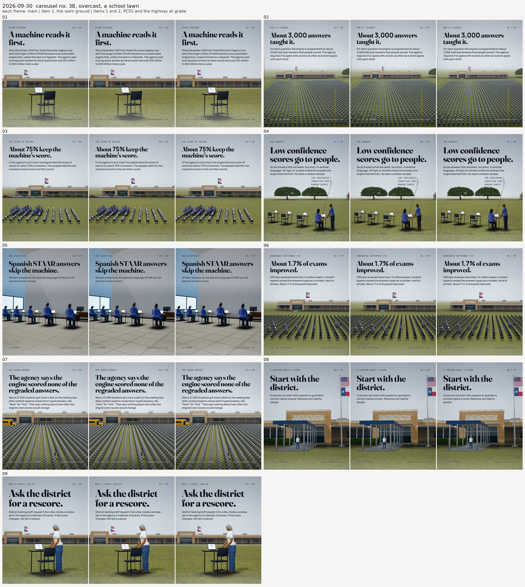
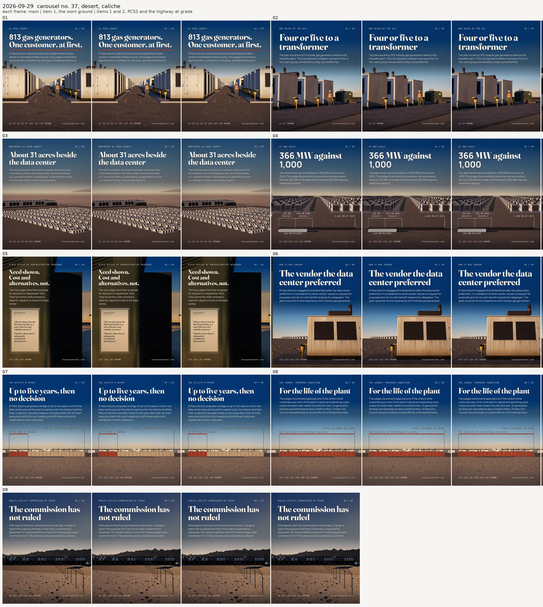
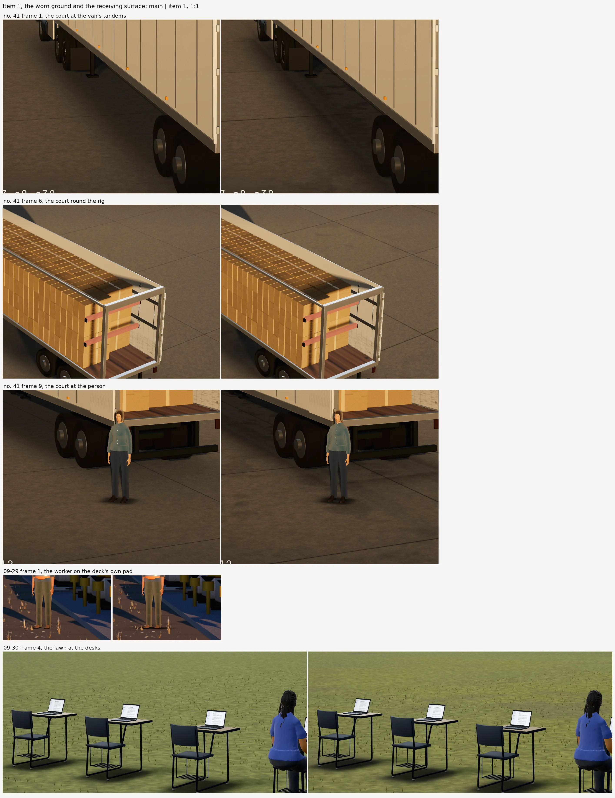
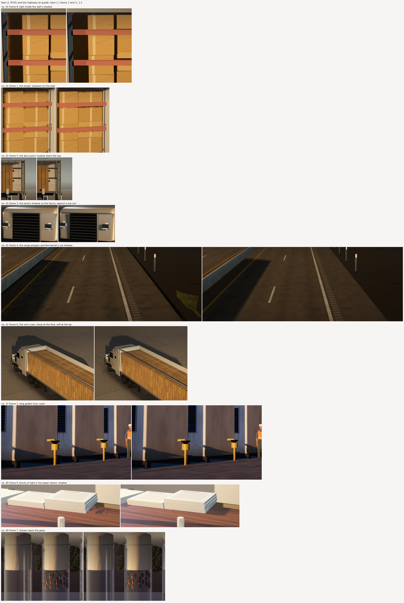
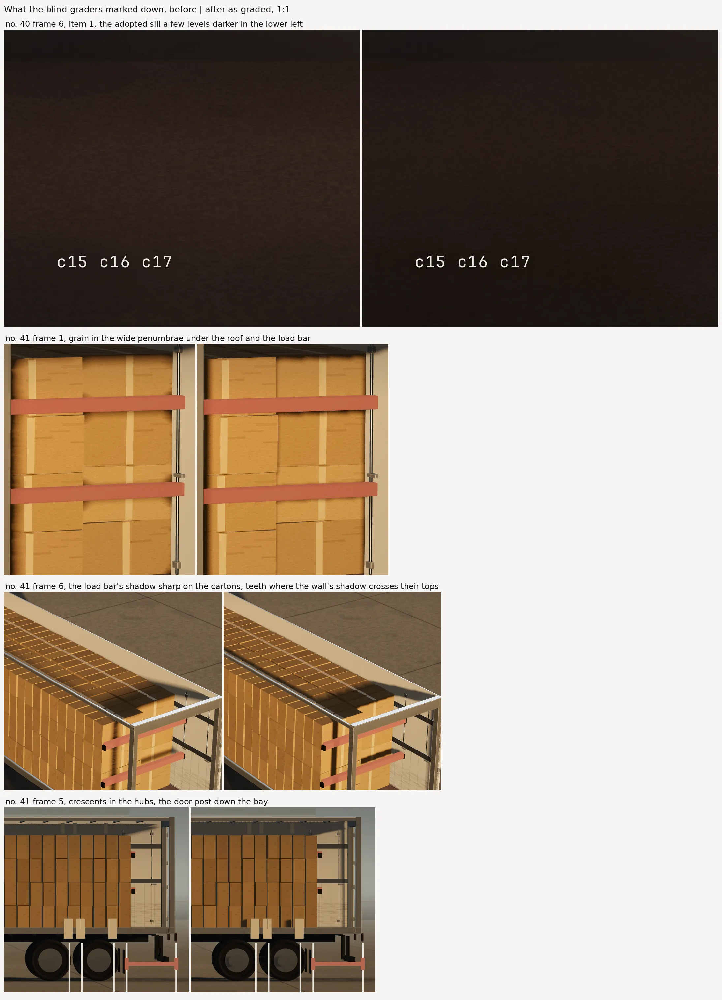
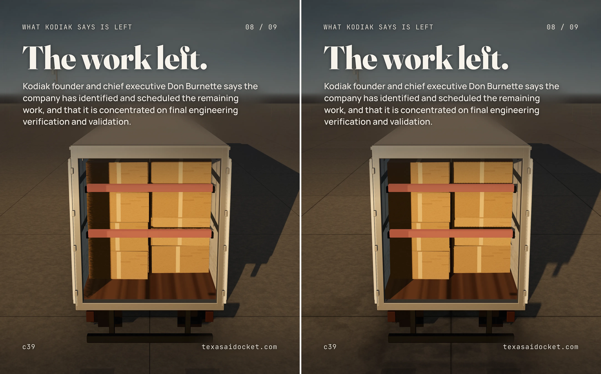
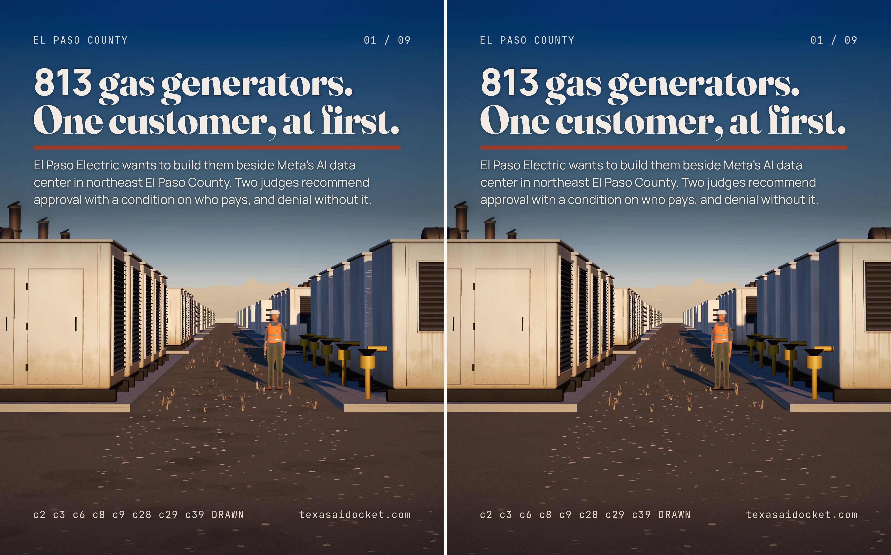
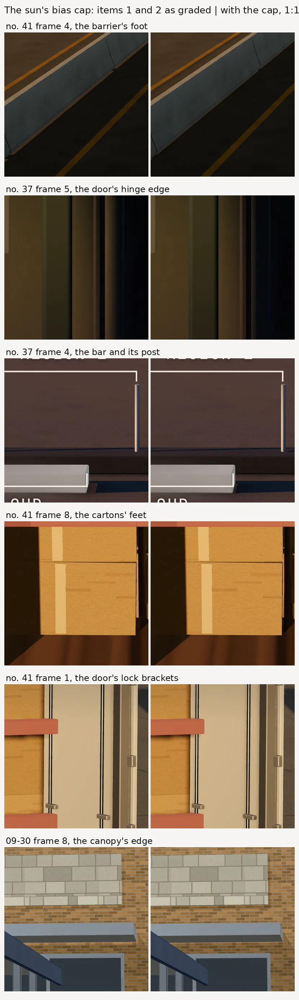

# ground-proof, the engine's ground and sun measured on four shipped decks

**This is a measurement of the ENGINE, never a subject or a palette to copy.** Every panel renders
a shipped deck's own slide HTML from `runs/carousel/`, unchanged, through the engine at three
states: `main` before 2026-10-03, item 1 (the worn ground and the receiving surface) and items 1 and
2 (plus the render artifacts). The frames differ in the engine alone, which is the only honest way
to show what the engine changed. The decks are carousel no. 41 (2026-10-03, a storm front over a
truck court and Interstate 45), no. 40 (2026-10-02, golden hour on a Houston lab's sill and in its
consult room), no. 38 (2026-09-30, an overcast school lawn and a classroom) and no. 37 (2026-09-29,
a desert generator yard at dusk).

`build.py` makes every image here from those three render sets and a fourth, items 1 and 2 as the
blind graders saw them before the sun's bias cap, and it says how to render them.

## What changed

**Item 1, the receiving surface.** Every `TXT.ground` wears in its own shader, in world space, so
its 6 m tile never repeats: value drifting at 11 and 41 m, a shade per concrete pour, grime held in
the saw cut joints, oil stains with a soaked ragged edge that fade out far off. `TXT.contact` marks
the ground under a thing's base as well as darkening it: a dirt band scaled to the footprint, oil
under a vehicle's body and two polished tyre tracks, grit at the base of a thing 35 cm or more
across. A deck's own flat pad takes the marks, and so does a sill or a ledge a thing stands on
outdoors, a weathered one keeping its weathering.

**Item 2, the render artifacts the judges named.** PCSS replaced VSM as the sun's shadow: sharp at
a thing's foot, soft at the tip, and it can't bleed light, which is what no. 41's fibrous carton
column was. Nine taps decide whether a pixel is at a shadow's edge, the disc turns on white noise,
a penumbra wider than 3 texels takes 48 taps, and the sun's shadow box grows by a margin it fades
out in, so a caster longer than the box no longer cuts off in a straight line. The sun's depth bias
never exceeds 2 cm, so a shadow starts at its caster's foot. The ground loses every depth tie, which
takes out the streaked band where no. 41's highway met its ground. The kit highway at grade has no
earthwork and no edge face (the flat yellow-olive verge polygon), and the kit concrete tile's forty
hard edged discs are soft blotches wrapped across the tile (the polka dots on no. 41's lanes).

**And the render clocks.** `render.py`'s report carries each slide's load time beside its render
time, and the kit's generator weathering draws its streaks on one layer and filters it once, where
it used to filter every stroke.

## The compares

Every deck at the 432 px thumb, each frame main | item 1 | items 1 and 2:

The regions each item changed most, 1:1 with the 2160 px render. Item 1 is main | item 1 and item 2
is item 1 | items 1 and 2, so each sheet shows one item's change alone:

The regions on every frame a blind grader marked down, through the renders they graded, shown as
plainly as the gains:

Two whole frames at full size, main | items 1 and 2:

## How the frames were graded

Blind, by fresh agents that had seen none of this work: one per deck for each comparison below,
135 frame pairs in all. Each got the rubric's `artwork_craft` descriptors
verbatim (10, 7 and 4, and "most good work is 7 to 8") and the SHOWSTOPPER TEST from
`ILLUSTRATION_SYSTEM.md`, and a sheet per frame with the two versions side by side at 900 px as A
and B, both whole frames at full size in a folder beside it to crop. Which side was which was
shuffled per frame by a seeded key, moved out of every folder a grader could open before the first
one started. A grader named each version's defects and strengths, scored each 1 to 10 to one
decimal, and said in a sentence what differs. The key was applied after the last one came back.

Graders are not calibrated against each other. The same nine item 1 renders of no. 41 scored
5.73 under the item 1 grader and 6.20 under the item 2 grader. So the number to read is the
difference inside one grader's sheet, never a score set against another grader's.

## Item 1, main against item 1

| deck | before | after | change | frames better | same | worse |
|---|---|---|---|---|---|---|
| no. 41 | 5.59 | 5.73 | +0.14 | 7 | 2 | 0 |
| no. 40 | 6.07 | 6.09 | +0.02 | 3 | 5 | 1 |
| no. 38 | 5.82 | 5.89 | +0.07 | 6 | 3 | 0 |
| no. 37 | 5.97 | 6.02 | +0.05 | 4 | 5 | 0 |
| all 36 frames | 5.86 | 5.93 | +0.07 | | | |

Worse:

- no. 40 frame 6, 6.6 to 6.5: the adopted sill came out a few levels darker in the lower left quarter, where the grader preferred it lighter.

## Item 2, item 1 against items 1 and 2

Graded before the sun's bias cap below, on the renders `zoom-worse.webp` shows.

| deck | before | after | change | frames better | same | worse |
|---|---|---|---|---|---|---|
| no. 41 | 6.20 | 6.36 | +0.16 | 4 | 1 | 4 |
| no. 40 | 5.57 | 6.01 | +0.44 | 9 | 0 | 0 |
| no. 38 | 5.66 | 5.64 | -0.02 | 4 | 1 | 4 |
| no. 37 | 6.37 | 6.40 | +0.03 | 3 | 3 | 3 |
| all 36 frames | 5.95 | 6.10 | +0.15 | | | |

Worse:

- no. 41 frame 1, 6.6 to 6.4: grainy, dithered halos in the shaded cargo bay and a speckled fringe along the open door's top edge.
- no. 41 frame 3, 6.4 to 6.2: the long diagonal shadow edge on the road steps along its length, and the lanes lost the stains item 1 had shown through them.
- no. 41 frame 5, 6.0 to 5.8: crescents inside both rear hubs and a grainy stripe down the rear door, shadows the old filter bled away.
- no. 41 frame 6, 6.8 to 6.5: the load bar's shadow on the cartons is a hard band, with teeth where the wall's shadow crosses the carton tops.
- no. 38 frame 1, 6.1 to 5.9: light and dark streaks inside the chair's shadow and a thin hard streak off one glide.
- no. 38 frame 2, 5.3 to 5.2: a band of darker shadow dashes beside the desks at mid depth, with almost none in the near rows.
- no. 38 frame 5, 5.7 to 5.4: the soft diagonal band VSM laid across the back wall is gone, so the wall is flat, and a thin stray wedge sits on it.
- no. 38 frame 8, 5.9 to 5.8: the canopy's and the slab's shadows read soft and vague, where VSM's read as defined bands.
- no. 37 frame 4, 6.4 to 6.3: the bar's shadow starts a few pixels to its right, which the bias cap below fixes, and the ground lost the stains item 1 had shown through the pad.
- no. 37 frame 5, 5.5 to 5.4: a dim warm strip of light along the open door's hinge edge, which the bias cap below removes.
- no. 37 frame 9, 6.9 to 6.7: three long thin stray shadow lines cross the ground left of the fence and stop mid field.

## The sun's bias cap, graded on its own

The item 2 graders named a shadow that starts off its caster's foot twice, at no. 41 frame 4's
barrier ("a thin lit strip separates the barrier foot from its shadow") and no. 37 frame 4's bar,
and no. 37 frame 5's strip of light along a door's hinge is the same fault. three.js reads a
shadow's bias as a fraction of the shadow camera's depth, so the rig's -0.0004 had grown to 6 cm of
no. 41's 160 m camera and 32 cm of no. 37's 800 m one, and PCSS's sharp foot showed what VSM's blur
had filled.

A first cap of 5 mm was graded blind the same way, items 1 and 2 as graded against the same with
that cap: no. 41 +0.04, no. 40 +0.00, no. 38 +0.01, no. 37 -0.02, 6 frames better and 3 worse. It seated those shadows, and on no. 37 it put blue violet specks at the louvre
blade ends down the generators' jambs, which the grader marked down on frames 1 and 6. `specks.py`
counts them over the louvres as the pixels more than 12 levels bluer than the uncapped render.
Frame 6 has 537 at 5 mm, 457 at 1 cm and 272 at 2 cm. Frame 1 has 4,185 at 5 mm, 4,027 at 1 cm, 3,776 at 2 cm, 2,903 at 5 cm and 5,361 at 2 cm on a 4096 map. They shrink as the bias grows and grow with
the map, which a shadow does and acne doesn't. They are the shadows of louvre blades the kit lets
jut past their frame, the "comb teeth" a grader named, lit by a dusk sky. A larger cap would lift
the feet again, so the cap is 2 cm, where no. 41 frame 4's barrier still sits in its shadow, and
the specks are the louvre model's to fix. Across the 36 frames the cap moves at most 0.65
percent of a frame's pixels. It binds on none of no. 40's frames, so all nine render
identically and no. 40 was not graded again. Graded blind, items 1 and 2 as graded against the same
with the 2 cm cap:

| deck | before | after | change | frames better | same | worse |
|---|---|---|---|---|---|---|
| no. 41 | 6.32 | 6.33 | +0.01 | 1 | 8 | 0 |
| no. 38 | 5.79 | 5.81 | +0.02 | 2 | 7 | 0 |
| no. 37 | 6.23 | 6.27 | +0.04 | 3 | 4 | 2 |
| all 27 frames | 6.11 | 6.14 | +0.03 | | | |

Worse:

- no. 37 frame 5, 5.4 to 5.3: the cap took the lit strip off the door's hinge edge, and the grader read the black leaf without it as a cut out.
- no. 37 frame 6, 6.9 to 6.8: blue grey dashes along the inner edges of both louvre jambs, the blade shadows the 5 mm cap drew, halved and still there.

The graders disagree about no. 37 frame 5's hinge. The item 2 grader marked the frame down for the
strip of light there, and the graders of both caps marked it down for losing it. The strip was
light the old bias let through, and with the cap the door leaf's shadow reaches the hinge. A frame
that wants a black door leaf parted from a dark wall lights that edge.

## The cuts before these, graded the same way

Each cut was graded blind before the next was made, and the next one answered what the graders
found. A grader's absolute numbers drift from one round to the next, so each line is that round's
own difference.

**Item 1.** The first cut moved no. 41 by +0.12 and no. 38 by +0.07, and found no difference at all
on no. 40 or no. 37: their things stand on a deck's own pad and a sill, and the mark went to the
ground hidden beneath. Adopting the pad and the sill fixed that, and the next round marked no. 40
down by 0.03, frames 3 and 4, where the band had moved onto the desk indoors. Indoors now stays
clean. The round after found no difference on no. 40 again, because the weathered sill refused the
mark, and marked no. 37 frame 3 down for striations in the oil. The final cut lets a weathered sill
keep its weather under the mark and gives the oil a soaked edge.

**Item 2.** The first cut of PCSS fitted a receiver plane and turned the disc on interleaved
gradient noise. It moved no. 41 by +0.10 with frames 1, 3, 5 and 6 worse, and no. 37 by -0.02 with
frames 5 to 9 worse: speckled columns, hatching inside a strap's shadow, lit specks along thin
casters, stipple. The second dropped the plane, turned on white noise and let nine taps decide where
an edge is. No. 41 went +0.14 with frames 1, 3 and 6 worse, and no. 38 -0.02 with frames 5 and 8
worse. Two of those were the fade, which ran over the box's own last 8 percent and took no. 41's
cab shade (frame 3, -0.3) and no. 38's canopy shadow on the walk (frame 8, -0.1). No. 38 frame 5
(-0.3) lost the soft band VSM had laid across its wall, and no. 41 frames 1 and 6 (-0.1 each) were
grain on the load and a sawtoothed rail shadow on the carton tops. The final cut fades in a margin
outside the box, never a lamp's shadow, and filters a penumbra wider than 3 texels with 48 taps.

## Render time

Every frame rendered on main's engine and then on this branch's, alternating frame by frame so any
drift in the machine falls on both alike, with nothing else running. `load` is the page's load
event, which `render.py` allows 45 s, and a slide whose script starts its work after that event
loads in 0.2 s. `total` is the slide's whole render. No. 40 frames 2 to 6
come from a second pass, because the first rendered them while the disk was full, which crashed two
of main's, and while old worktrees were being deleted. No. 37 is faster on this branch because the
kit's generator weathering now filters its streaks once, and most of its frames carry generators.
The bias cap came after these clocks. It is a getter three.js reads once per shadowed light per
draw.

| deck | frame | main load | main total | branch load | branch total | change |
|---|---|---|---|---|---|---|
| no. 41, 2026-10-03 | 01 | 0.2 | 27.6 | 0.2 | 33.7 | +6.1 |
| no. 41, 2026-10-03 | 02 | 0.2 | 32.3 | 0.2 | 39.5 | +7.2 |
| no. 41, 2026-10-03 | 03 | 0.2 | 20.9 | 0.2 | 25.4 | +4.5 |
| no. 41, 2026-10-03 | 04 | 0.2 | 36.2 | 0.1 | 42.6 | +6.4 |
| no. 41, 2026-10-03 | 05 | 0.2 | 21.0 | 0.2 | 25.8 | +4.8 |
| no. 41, 2026-10-03 | 06 | 0.2 | 25.1 | 0.2 | 31.6 | +6.5 |
| no. 41, 2026-10-03 | 07 | 0.2 | 20.3 | 0.2 | 24.3 | +4.0 |
| no. 41, 2026-10-03 | 08 | 0.2 | 29.9 | 0.2 | 31.1 | +1.2 |
| no. 41, 2026-10-03 | 09 | 0.2 | 28.9 | 0.2 | 31.3 | +2.4 |
| no. 40, 2026-10-02 | 01 | 0.2 | 20.2 | 0.2 | 23.3 | +3.1 |
| no. 40, 2026-10-02 | 02 | 0.2 | 19.0 | 0.2 | 23.5 | +4.5 |
| no. 40, 2026-10-02 | 03 | 15.6 | 18.8 | 22.2 | 25.3 | +6.5 |
| no. 40, 2026-10-02 | 04 | 14.2 | 17.2 | 18.6 | 21.5 | +4.3 |
| no. 40, 2026-10-02 | 05 | 20.0 | 23.4 | 24.1 | 27.4 | +4.0 |
| no. 40, 2026-10-02 | 06 | 0.2 | 34.8 | 0.2 | 43.2 | +8.4 |
| no. 40, 2026-10-02 | 07 | 30.1 | 33.7 | 36.2 | 39.4 | +5.7 |
| no. 40, 2026-10-02 | 08 | 0.2 | 26.5 | 0.2 | 31.9 | +5.4 |
| no. 40, 2026-10-02 | 09 | 0.2 | 20.4 | 0.2 | 27.7 | +7.3 |
| no. 38, 2026-09-30 | 01 | 2.9 | 17.2 | 3.6 | 19.8 | +2.6 |
| no. 38, 2026-09-30 | 02 | 4.9 | 24.4 | 4.8 | 29.8 | +5.4 |
| no. 38, 2026-09-30 | 03 | 8.5 | 32.8 | 9.3 | 39.0 | +6.2 |
| no. 38, 2026-09-30 | 04 | 4.6 | 22.1 | 5.0 | 26.6 | +4.5 |
| no. 38, 2026-09-30 | 05 | 7.3 | 21.6 | 7.6 | 27.2 | +5.6 |
| no. 38, 2026-09-30 | 06 | 5.5 | 22.6 | 5.5 | 29.0 | +6.4 |
| no. 38, 2026-09-30 | 07 | 5.4 | 26.7 | 6.5 | 30.7 | +4.0 |
| no. 38, 2026-09-30 | 08 | 4.8 | 21.4 | 5.1 | 25.3 | +3.9 |
| no. 38, 2026-09-30 | 09 | 4.6 | 18.9 | 4.5 | 22.0 | +3.1 |
| no. 37, 2026-09-29 | 01 | 37.3 | 66.2 | 9.4 | 45.0 | -21.2 |
| no. 37, 2026-09-29 | 02 | 33.2 | 53.2 | 7.1 | 31.5 | -21.7 |
| no. 37, 2026-09-29 | 03 | 4.1 | 19.7 | 4.1 | 21.9 | +2.2 |
| no. 37, 2026-09-29 | 04 | 2.1 | 18.5 | 2.6 | 20.8 | +2.3 |
| no. 37, 2026-09-29 | 05 | 36.3 | 60.9 | 6.7 | 36.9 | -24.0 |
| no. 37, 2026-09-29 | 06 | 12.1 | 27.8 | 3.5 | 22.5 | -5.3 |
| no. 37, 2026-09-29 | 07 | 35.5 | 51.0 | 5.5 | 23.4 | -27.6 |
| no. 37, 2026-09-29 | 08 | 34.3 | 50.2 | 5.4 | 23.9 | -26.3 |
| no. 37, 2026-09-29 | 09 | 2.5 | 17.1 | 3.9 | 19.6 | +2.5 |
| | all | | 1028 | | 1043 | +15 |

- no. 41, 2026-10-03: 242 s on main and 285 s on this branch, +1.2 to +7.2 s a frame and +4.8 s on average. The slowest load is 0.2 s on main and 0.2 s here.
- no. 40, 2026-10-02: 214 s on main and 263 s on this branch, +3.1 to +8.4 s a frame and +5.5 s on average. The slowest load is 30.1 s on main and 36.2 s here.
- no. 38, 2026-09-30: 208 s on main and 249 s on this branch, +2.6 to +6.4 s a frame and +4.6 s on average. The slowest load is 8.5 s on main and 9.3 s here.
- no. 37, 2026-09-29: 365 s on main and 246 s on this branch, -27.6 to +2.5 s a frame and -13.2 s on average. The slowest load is 37.3 s on main and 9.4 s here.
- The 27 frames of nos. 41, 40 and 38 take +5.0 s a frame on a main average of 24.6 s, +20 percent.

Timed inside the page on no. 37 frame 1, drawn three more times after its first draw, twice on each engine, item 1's VSM draws the frame in 23.8 to 27.2 s and PCSS in 27.1 to 28.8 s. The first draw, which compiles the shaders, takes 31.2 to 32.0 s on VSM and 36.5 to 37.4 s on PCSS.

## What is still open

- **Item 3, the stormFront sky, is not in this change.** No. 41's 10.2 degree lens holds about 3
  degrees of sky, and the dome's cloud layer fades out over its lowest 7 degrees
  (`smoothstep(0, 0.12, h)`), so a long lens looks at a flat gradient. A shelf cloud band is
  prototyped and has not been graded.
- **Item 4, the kit models at close range, is not in this change.** The tractor's hubs are plain
  discs, its mirror glass is a perfect mirror that prints blocky noise, the person reads as a doll
  (no. 41 frame 9, "a mask-like face, stiff arms"), and `dry_van`, `delineator`,
  `raised_pavement_marker` and the truck hub still live in no. 41's chassis rather than the kit.
- **Grain in a wide penumbra** still shows at full size (no. 41 frames 1 and 5). A blue noise
  rotation would lower it and needs a texture bound to every lit material.
- **Texel steps along a long diagonal shadow edge on a grazing ground** (no. 41 frame 3's road). A
  likely cause, not measured: the minimum filter is sized along the screen axis where a texel is
  smallest, so it stays near its 1.5 texel floor where a texel spans a dozen pixels across the edge.
- **A crisp shadow shows every step it crosses** (no. 41 frame 6, a tooth at each carton top), and
  **small shadows VSM bled away come back** (a hub's crescent, a door post down a bay). A part that
  catches one wants enough model to carry it.
- **The kit highway's lanes are clean.** The ground loses its depth tie with the road now, so its
  stains no longer show through. A grader had read those stains as "repeated oval dark stains ...
  stamped rather than worn", so an asphalt stain wants a drip trail's shape before a lane takes it.
- **No. 38 frame 5's wall** lost the soft band VSM laid across it, which a grader preferred. A frame
  that wants a gradient on a wall lights the wall for it.
- **A spotlight's bias** starts no. 40 frame 4's vial shadow a few centimetres off its base. It is
  the deck's own light, and TECHNIQUE_LIBRARY now says how to set one. The same window spot leaves a
  fine crosshatch in the shadow on the desk beside no. 40's paper stacks (frames 2 and 9), finer
  than the blocks VSM drew there and still visible at full size.
- **A pad built as a box lower than 25 cm** still puts its contact and mark on the ground beneath
  it, **no. 40's coping** reads as a smooth slab between marks, **a low sun along a low kerb** draws
  the kerb's sliver of shadow as a fine dark line, and **the far end of no. 41 frame 4's barrier
  shadow** shows a comb where the shadow is far off.
- **The 2 cm cap drew a faint dashed line along no. 41 frame 4's far shoulder**, where the barrier's
  toe meets it. A blind grader found it at 2x and scored the frame the same with and without it.
- **No. 37's louvre blades jut past their frames**, the "comb teeth" a grader named, and under the
  2 cm cap their ends still lay blue violet specks down the jambs of frames 1 and 6. `mggLouvres` in
  `assets/js/kit/power.js` tilts a 7 cm blade 0.55 rad about a line 2.5 cm out from the face, so
  its front edge stands 2.3 cm proud of a frame whose front is 3.5 cm out. The fix is the
  kit's louvre panel, which item 4 would take.
- **The optional `qa.py` rule for a display hook's touching serifs was not done.** The pixel
  critic's definition now names the thumbs `slide-0N-thumb.png`.
