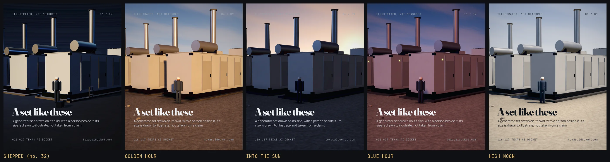
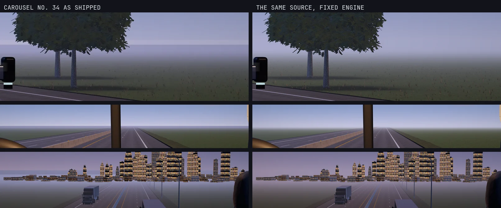

# world-proof, the engine's world measured on carousel no. 32's own model

**This is a measurement of the ENGINE, never a subject or a palette to copy.** Every panel in
`compare.webp` renders the same generator set, the same person and the same camera as frame 6 of
carousel no. 32. The shipped frame is on the left. The four on the right differ from it in the
engine alone, which is the only honest way to show what the engine changed.



## What was wrong, measured on 2026-09-24 rather than guessed

1. **No world.** `TXT.setup` gave a frame a flat background colour and a grey plane. Seven chassis
   under `assets/js/deck/` each improvised a sky, and no. 32's was near black with a two degree
   band. Every frame was an object in a void, which is the craft finding under thirty two decks.
2. **Hard shadows the rigs never asked for.** Every rig set `shadow.radius`, and
   `PCFSoftShadowMap` ignores it. VSM is now the default and radius works.
3. **Two tone curves.** The renderer mapped ACES, then `TXDECK.finish` ran a second filmic curve
   over the result. Pure white came out near 231 of 255 and the mids lifted, which is the murk.
   `TXT.snapshot` now marks the page and the grade skips its own curve on a rendered frame.
4. **Clean clay.** Nothing real is clean at the bottom. `TXT.weather` darkens toward the ground
   and mottles roughness in world space.

## The horizon, measured on carousel no. 34 (2026-09-26)



The same slide source on both sides: no. 34's frames 1, 3 and 9 as they shipped, and re-rendered
through the fixed engine. Every judge read the left side as sea, in all five rounds, and no run's
fix touched it, because the cause was the engine. three.js mixes fog in after tone mapping in a
colour that is never tone mapped, while the dome is. So the fogged ground printed the raw haze,
26.6 levels off the sky directly above it in `tests/txworld.mjs`, and 2.5 after the fix. The fog
is now the sky's own colour in every direction, a far field carries the ground to the horizon, and
far models haze toward the sky, heaviest near the ground.

## The world in five calls

```js
// the chassis, once: TXDECK.declare({ ..., light:{ az:-40, el:10 }, sky:'goldenHour' })
const W = TXT.deckWorld();                  // goldenHour, blueHour, nightSodium, highNoon, overcast, stormFront
const R = TXT.setup(gl, { w:1080, h:1350, fog:[W.haze, W.fogDensity], exposure:W.exposure, tone:W.tone, fov:38 });
TXT.frame(R, { from:[-17.5, 2.0, 10.5], look:[-3, 2.3, -2.2] });
TXT.sky(R);                                 // the dome, IBL rendered FROM it, fog in its horizon hue
TXT.deckRig(R, W.rig, { target:[-3,0,-14], distance:120 });   // the sun IS the deck's declared light
TXT.ground(R, { surface:'caliche', size:900, tile:5 });       // caliche, dirt, asphalt, concrete, grass
TXT.scatter(R, { kind:'grass', count:7000, area:[-120,-280,90,40], avoid:[[-26,-200,14,30]] });
TXT.add(R, hero); TXT.contact(R, hero);     // the dark core where it meets the ground
TXT.weather(R, {});                         // grime at the base, mottle in the paint
const shot = await TXT.snapshot(R);
```

`build.py` regenerates the four slides in `slides/`. It borrows no. 32's chassis model and
swallows that chassis's declaration so it can set a new light, which a real deck never does. Render
with `python3 .claude/skills/carousel-engine/render.py --slides-dir examples/world-proof/slides --out-dir out/world-proof`.

## What it is not

It is not what a deck should look like. A deck picks its OWN hero, its own world for its own story
and its own camera. What this proves is the FLOOR under all of them: a sky with a horizon, light
from a sun that the shadows agree with, haze in the horizon's hue, a ground with tooth, contact
under every standing thing, and weathered material. A frame below this floor is not finished.
